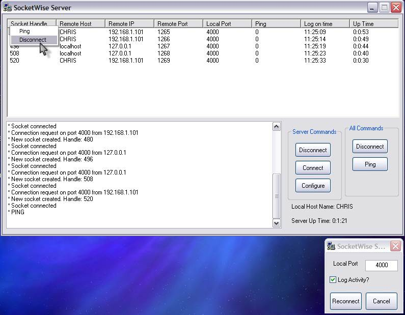



## Winsock API server

### Description

This is a fully functioning server written without the use of the Winsock control. It uses API only. It can accept a theoretically unlimited number of clients and features an ICMP ping feature. This code uses my recently submitted Winsock API DLL. Download it here: http://www.pscode.com/vb/scripts/ShowCode.asp?txtCodeId=39858&lngWId=1  Your votes and comments are greatly appreciated ;)
 
### More Info
 

             |
---                |---
**Submitted On**   |2002-10-16 23:30:26
**By**             |[IRBMe](https://github.com/Planet-Source-Code/PSCIndex/blob/master/ByAuthor/irbme.md)
**Level**          |Intermediate
**User Rating**    |4.8 (29 globes from 6 users)
**Compatibility**  |VB 5\.0, VB 6\.0
**Category**       |[Internet/ HTML](https://github.com/Planet-Source-Code/PSCIndex/blob/master/ByCategory/internet-html__1-34.md)
**World**          |[Visual Basic](https://github.com/Planet-Source-Code/PSCIndex/blob/master/ByWorld/visual-basic.md)
**Archive File**   |[Winsock\_AP14735810172002\.zip](https://github.com/Planet-Source-Code/irbme-winsock-api-server__1-39898/archive/master.zip)

